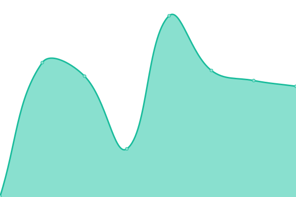

# [📈 Live Status](https://unliar.github.io/happy-upptime): <!--live status--> **🟩 All systems operational**

This repository contains the open-source uptime monitor and status page for [远浅](happysooner.com), powered by [Upptime](https://github.com/upptime/upptime).

With [Upptime](https://upptime.js.org), you can get your own unlimited and free uptime monitor and status page, powered entirely by a GitHub repository. We use [Issues](https://github.com/unliar/happy-upptime/issues) as incident reports, [Actions](https://github.com/unliar/happy-upptime/actions) as uptime monitors, and [Pages](https://unliar.github.io/happy-upptime) for the status page.

<!--start: status pages-->
<!-- This summary is generated by Upptime (https://github.com/upptime/upptime) -->
<!-- Do not edit this manually, your changes will be overwritten -->
<!-- prettier-ignore -->
| URL | Status | History | Response Time | Uptime |
| --- | ------ | ------- | ------------- | ------ |
|  [happysooner.com](https://happysooner.com) | 🟩 Up | [happysooner-com.yml](https://github.com/unliar/happy-upptime/commits/HEAD/history/happysooner-com.yml) | 

 387ms
     
 | 

<a href="https://unliar.github.io/happy-upptime/history/happysooner-com">100.00%</a>
    

|  [vue-next.happysooner.com](https://vue-next.happysooner.com) | 🟩 Up | [vue-next-happysooner-com.yml](https://github.com/unliar/happy-upptime/commits/HEAD/history/vue-next-happysooner-com.yml) | 

 252ms
     
 | 

<a href="https://unliar.github.io/happy-upptime/history/vue-next-happysooner-com">100.00%</a>
    

|  [unliar.github.io/vue3-ts-happysooner-web](https://unliar.github.io/vue3-ts-happysooner-web) | 🟩 Up | [unliar-github-io-vue3-ts-happysooner-web.yml](https://github.com/unliar/happy-upptime/commits/HEAD/history/unliar-github-io-vue3-ts-happysooner-web.yml) | 

 99ms
     
 | 

<a href="https://unliar.github.io/happy-upptime/history/unliar-github-io-vue3-ts-happysooner-web">100.00%</a>
    

|  [flyneko.com](https://flyneko.com) | 🟩 Up | [flyneko-com.yml](https://github.com/unliar/happy-upptime/commits/HEAD/history/flyneko-com.yml) | 

 72ms
     
 | 

<a href="https://unliar.github.io/happy-upptime/history/flyneko-com">100.00%</a>
    

<!--end: status pages-->

[**Visit our status website →**](https://unliar.github.io/happy-upptime)

## 📄 License

- Code: [MIT](./LICENSE) © [远浅](happysooner.com)
- Data in the `./history` directory: [Open Database License](https://opendatacommons.org/licenses/odbl/1-0/)
